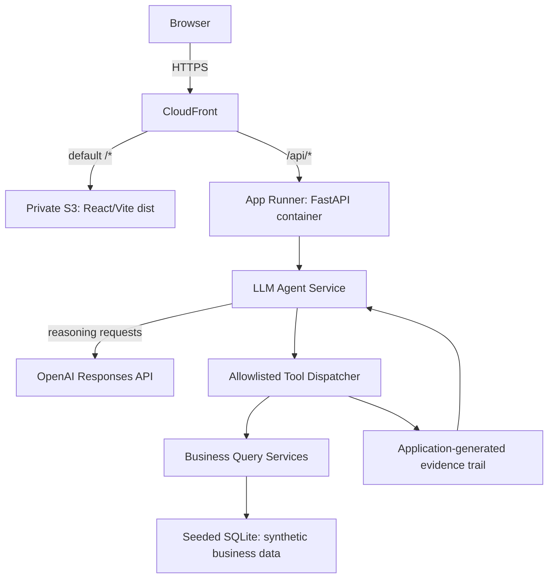

# OpsPilot

## Overview

OpsPilot is a portfolio-quality AI business-operations agent. It turns a business question into a traceable answer: an OpenAI Responses API agent selects structured business tools, the application queries synthetic operational data, and the frontend presents an evidence-backed recommendation. The project deliberately demonstrates practical agent/tool orchestration and business workflows without hiding the control flow behind a framework.

## Architecture



In production, CloudFront is the intended public application entry point: private S3 serves the React/Vite assets by default and `/api/*` is forwarded over HTTPS to App Runner, preserving same-origin requests. App Runner's normal service URL remains directly internet-accessible by design; private ingress is intentionally not used because it would add VPC/PrivateLink infrastructure and cost. OpenAI chooses which allowlisted tool to request; the application validates and executes that request. The LLM never accesses the database directly. Evidence is constructed by the application from actual tool results, and a recommendation is returned only when supporting evidence exists.

## Key engineering safeguards

- Strict tool schemas and an explicit allowlisted dispatcher; no dynamic dispatch or `eval`.
- Sequential tool execution, a four-call cap, and duplicate-call detection.
- Structured final model output and a recommendation-evidence guardrail.
- Synthetic, deterministic business data separated from agent orchestration.
- Controlled configuration and provider errors, plus frontend validation of successful response shapes.

## Example questions

1. Compare FW-100 sales and inventory. Is there a replenishment risk and what should we do?
2. Which product appears overstocked relative to demand, and what action would you recommend?
3. How is the Turbo Video Launch campaign performing, and should we continue spending on it?
4. How much inventory is available for FW-100?

## Screenshot

The initial workspace lets an operator enter a business question or start from a representative prompt.


## Local development

### Backend

From `backend/`, create and activate a virtual environment, then install development dependencies:

```powershell
python -m venv .venv
.\.venv\Scripts\Activate.ps1
python -m pip install -e ".[dev]"
```

Copy `.env.example` to `.env` only when overriding local defaults. `OPENAI_API_KEY` is supplied through the environment and is required for live agent questions; never commit it. The health endpoint and automated tests do not require an OpenAI key or PostgreSQL because tests use SQLite and mocks.

Run the API at <http://localhost:8000>:

```powershell
uvicorn app.main:app --reload
```

The health endpoint is `GET /api/health`. To seed the synthetic demo data, configure a database and run:

```powershell
python -m app.db.seed
```

For a disposable SQLite database:

```powershell
$env:DATABASE_URL = "sqlite:///./opspilot-demo.db"
python -m app.db.seed
```

### Frontend

From `frontend/`:

```powershell
npm install
npm run dev
```

Vite serves the UI at <http://localhost:5173> and proxies `/api` to the local FastAPI server.

## Quality checks

Backend, from `backend/`:

```powershell
python -m pytest
python -m ruff check app tests
python -m mypy app
python -m compileall -q app tests
```

Frontend, from `frontend/`:

```powershell
npm test -- --run
npm run lint
npm run typecheck
npm run build
```

GitHub Actions runs these independent backend and frontend quality jobs for pull requests and pushes to `main`. It uses no secrets, live OpenAI calls, or PostgreSQL service.

## AWS deployment (prepared, not yet deployed)

Task 007 prepares a small, destroyable AWS deployment in [`infra/terraform/`](infra/terraform/). It has not been applied to AWS yet.

The architecture is intentionally limited to a private S3 frontend bucket behind CloudFront, with `/api/*` routed by the same CloudFront distribution to an App Runner FastAPI container. This preserves the frontend's relative `/api/agent/query` request path and avoids a production CORS configuration. App Runner is used instead of Lambda/API Gateway because an agent request can make several sequential OpenAI calls and should not be constrained by a short API Gateway integration timeout.

The backend image runs Python 3.12, seeds deterministic synthetic SQLite data at `sqlite:////tmp/opspilot.db`, and then starts one Uvicorn process on port 8080. The deployed database is deliberately ephemeral and read-only to the application: a single App Runner instance can safely recreate the same seed data when replaced. PostgreSQL support remains available for normal local configuration.

Terraform uses normal local state only. It creates an immutable, scan-on-push ECR repository (retaining five images), App Runner at 0.25 vCPU / 0.5 GB with exactly one instance, a private S3 bucket with Origin Access Control, and one CloudFront distribution. No VPC, RDS, load balancer, API Gateway, Lambda, remote state, custom domain, or CI/CD deployment pipeline is provisioned.

### Initial deployment

Prerequisites are Terraform, Docker, AWS CLI credentials for the target account, and an OpenAI key in a local environment variable. Never place the key in `terraform.tfvars`, source control, a Docker image, or a shell command literal.

Set the region and create or update the SecureString outside Terraform. This command reads the value from the local environment rather than documenting it in command history:

```powershell
$region = "ap-southeast-2"
if (-not $env:OPENAI_API_KEY) { throw "Set OPENAI_API_KEY in your environment first." }
aws ssm put-parameter --region $region --name /opspilot/prod/openai-api-key --type SecureString --value $env:OPENAI_API_KEY --overwrite
```

The first deployment deliberately has two phases because the private ECR repository must exist before an image can be pushed. From `infra/terraform/`, initialize Terraform and bootstrap only ECR (the target is limited to this one-time bootstrap):

```powershell
terraform init
$imageTag = git -C ../.. rev-parse HEAD
terraform apply -target=aws_ecr_repository.backend -target=aws_ecr_lifecycle_policy.backend -var="backend_image_tag=$imageTag"
```

Then authenticate to ECR, build and push the immutable Git-SHA-tagged backend image, and perform the normal full apply:

```powershell
$repository = terraform output -raw ecr_repository_url
$registry = $repository.Split('/')[0]
aws ecr get-login-password --region $region | docker login --username AWS --password-stdin $registry
docker build --platform linux/amd64 --tag "opspilot-backend:$imageTag" ../../backend
docker tag "opspilot-backend:$imageTag" "${repository}:$imageTag"
docker push "${repository}:$imageTag"
terraform apply -var="backend_image_tag=$imageTag"
```

After Terraform creates the bucket and distribution, build and upload the frontend outside Terraform. Terraform manages infrastructure, not each compiled Vite file:

```powershell
Push-Location ../../frontend
npm ci
npm run build
Pop-Location
$bucket = terraform output -raw frontend_bucket_name
$distributionId = terraform output -raw cloudfront_distribution_id
aws s3 sync ../../frontend/dist "s3://$bucket" --delete
aws cloudfront create-invalidation --distribution-id $distributionId --paths "/*"
```

The public application URL is `terraform output -raw application_url`. CloudFront is the intended public application entry point and preserves the frontend's same-origin `/api/*` path. App Runner's standard service URL remains directly internet-accessible by design; private ingress is intentionally not used because it would require additional VPC/PrivateLink infrastructure and cost. Later production smoke checks should call `GET /api/health` through the CloudFront URL, load the frontend, and perform one controlled agent query only after confirming the OpenAI billing and key configuration. This repository has not yet run those AWS checks or an AWS apply.

To tear down a deployment, remove frontend objects if necessary and then destroy with the same immutable image tag:

```powershell
aws s3 rm "s3://$bucket" --recursive
terraform destroy -var="backend_image_tag=$imageTag"
```

App Runner's minimum of one 0.25 vCPU / 0.5 GB instance is a deliberate availability and cost trade-off: it incurs running cost even without requests, while max instances and concurrency are capped at one and ten respectively. ECR storage, S3 storage/requests, and CloudFront delivery also incur usage-based charges. Destroy resources promptly when the demo is not needed.

The S3 bucket intentionally uses `force_destroy = false`, so frontend objects are removed manually before destroy. The Terraform-managed ECR repository uses `force_delete = true`, so its images are removed with the repository. The SSM SecureString is created outside Terraform and remains unless it is manually deleted.

## Limitations

- All business data is synthetic demo data.
- A local OpenAI API key is needed for live agent questions.
- There is no authentication, user account system, or persistent conversation history.
- Responses do not stream.
- AWS deployment code is prepared but has not been applied or production-smoke-tested yet.
- This deployment has no authentication and its App Runner/API endpoint is public. Successful agent calls consume OpenAI API usage, so it is intended only as a controlled portfolio/demo deployment; configure provider billing and usage controls before public use, and destroy it when not needed.

See [ROADMAP.md](ROADMAP.md) for the planned delivery sequence.
