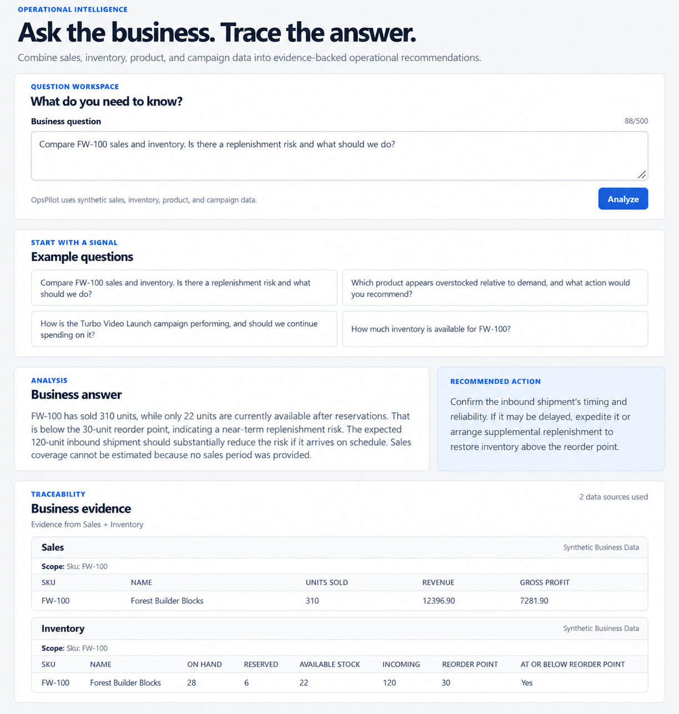
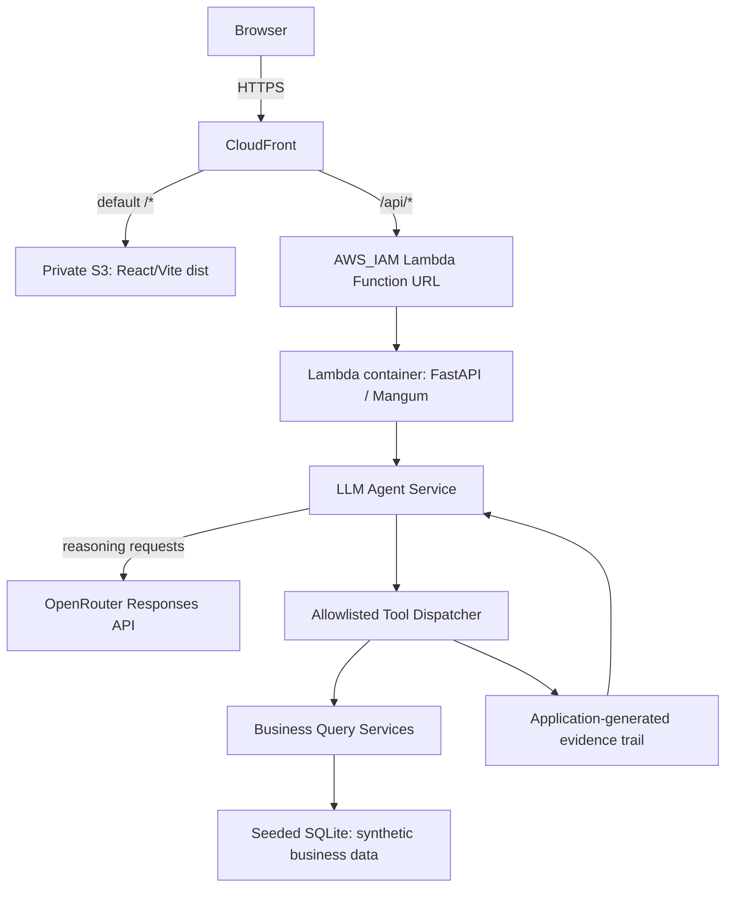

# OpsPilot

[](https://github.com/yi0805/opspilot/actions/workflows/ci.yml)

OpsPilot is an end-to-end AI business-operations agent that turns operational questions into traceable answers and evidence-backed recommendations using synthetic business data.

## Live demo

[Open the deployed demo](https://d10nfs9ms4ms1h.cloudfront.net)

## At a glance

| Area | Implementation |
| --- | --- |
| What I built | An end-to-end operations-analysis demo that connects business questions to answers, recommendations, and their underlying evidence. |
| Frontend | React, TypeScript, and Vite, served from private S3 through CloudFront. |
| Backend | Python, FastAPI, Mangum, SQLAlchemy, and deterministic synthetic business data. |
| AI controls | OpenRouter-routed Responses API calls through the official OpenAI Python SDK; explicit allowlisted tools, sequential execution, local validation, and a four-call limit. |
| Trust | Evidence is constructed and owned by the application; a recommendation is returned only when successful tool results provide supporting evidence. The model has no direct database access. |
| AWS and delivery | Terraform-managed CloudFront, private S3, ECR, Lambda container image, SSM Parameter Store, and least-privilege IAM. CloudFront signs Lambda-origin requests with SigV4; unsigned direct Function URL requests are denied. |
| Quality | GitHub Actions runs independent backend and frontend tests, linting, type checks, and build/compile checks. |
| Demo data | All business data is synthetic. |

## What it does

- An operator asks an operational business question.
- An OpenRouter-routed Responses API agent selects from allowlisted structured tools.
- The application queries deterministic synthetic business data.
- The application records evidence from the tool results.
- The UI returns an answer and, when the evidence supports it, a recommendation.

The model requests tools; it does not access the database directly.

## Visual result

A completed OpsPilot analysis connects the recommendation directly to the operational evidence used to support it.



### Question workspace

The workspace also provides representative prompts for exploring the synthetic business data.


## Engineering highlights

- Direct Responses API tool calling through OpenRouter, using the official OpenAI Python SDK with OpenRouter's base URL and no agent-orchestration framework.
- An explicit allowlisted tool dispatcher with strict schemas, sequential execution, and call safeguards.
- Application-generated evidence and a guardrail that requires evidence before a recommendation is returned.
- A FastAPI and SQLAlchemy backend over deterministic synthetic business data.
- A React and TypeScript frontend that presents results, recommendations, and evidence.
- Independent automated backend and frontend quality checks in GitHub Actions.
- Terraform-managed AWS delivery: CloudFront serves a private S3 frontend and reaches an `AWS_IAM` Lambda Function URL through Origin Access Control; the OpenRouter credential is an external SSM SecureString.

## Architecture



CloudFront is the public application entry point: private S3 serves the React/Vite assets by default and `/api/*` is forwarded over HTTPS to a Lambda Function URL, preserving same-origin requests. The Function URL uses `AWS_IAM` with buffered invocation; CloudFront signs every Lambda-origin request with SigV4 through Origin Access Control, and the policy is scoped to the application distribution. Direct unsigned Function URL requests are denied. OpenRouter selects which allowlisted tool to request; the application validates and executes that request. The LLM never accesses the database directly. Evidence is constructed by the application from actual tool results, remains authoritative over model-generated content, and a recommendation is returned only when supporting evidence exists.

### AI provider and workflow

OpenRouter is the production AI provider/router. The application retains the official `openai` Python SDK and sends Responses API requests through OpenRouter's base URL using model `openai/gpt-5.6-luna`. It intentionally uses normal OpenRouter provider routing: `provider.require_parameters` is not set on either reasoning or final requests because the constraint was production-verified to cause a 404 routing failure.

The agent workflow is unchanged: the application executes only allowlisted tools sequentially (`parallel_tool_calls=False`), then makes a final request with tools disabled and structured output. Application-owned evidence is built from successful tool results and is the authoritative source for the response.

## Example questions

1. Compare FW-100 sales and inventory. Is there a replenishment risk and what should we do?
2. Which product appears overstocked relative to demand, and what action would you recommend?
3. How is the Turbo Video Launch campaign performing, and should we continue spending on it?
4. How much inventory is available for FW-100?

## Local development

### Backend

From `backend/`, create and activate a virtual environment, then install development dependencies:

```powershell
python -m venv .venv
.\.venv\Scripts\Activate.ps1
python -m pip install -e ".[dev]"
```

Copy `.env.example` to `.env` only when overriding local defaults. `OPENROUTER_API_KEY` is supplied through the environment and is required for live agent questions; never commit it. The health endpoint and automated tests do not require an OpenRouter key or PostgreSQL because tests use SQLite and mocks.

Run the API at <http://localhost:8000>:

```powershell
uvicorn app.main:app --reload
```

The health endpoint is `GET /api/health`. To seed the synthetic demo data, configure a database and run:

```powershell
python -m app.db.seed
```

For a disposable SQLite database:

```powershell
$env:DATABASE_URL = "sqlite:///./opspilot-demo.db"
python -m app.db.seed
```

### Frontend

From `frontend/`:

```powershell
npm install
npm run dev
```

Vite serves the UI at <http://localhost:5173> and proxies `/api` to the local FastAPI server.

## Quality checks

Backend, from `backend/`:

```powershell
python -m pytest
python -m ruff check app tests
python -m mypy app
python -m compileall -q app tests
```

Frontend, from `frontend/`:

```powershell
npm test -- --run
npm run lint
npm run typecheck
npm run build
```

GitHub Actions runs these independent backend and frontend quality jobs for pull requests and pushes to `main`. It uses no secrets, live provider calls, or PostgreSQL service.

## AWS deployment (deployed and production-smoke-tested)

Task 007 deployed a small, cost-conscious AWS environment in [`infra/terraform/`](infra/terraform/). The public application is available at <https://d10nfs9ms4ms1h.cloudfront.net>.

The architecture is intentionally limited to a private S3 frontend bucket behind CloudFront, with `/api/*` routed by the same distribution to a Lambda Function URL backed by a Lambda-compatible FastAPI/Mangum container. This preserves the frontend's relative `/api/agent/query` request path and avoids a production CORS configuration. App Runner was removed because it is unavailable while this AWS account remains on its Free plan; Lambda provides request-driven execution without API Gateway.

The backend image runs the AWS Lambda Python 3.12 runtime. On Lambda cold start it loads the OpenRouter key from the external SSM SecureString only if no process key is already set, seeds deterministic synthetic SQLite data at `sqlite:////tmp/opspilot.db`, then adapts the FastAPI application with Mangum. The deployed database is deliberately ephemeral and read-only to the application. PostgreSQL support remains available for normal local configuration. Lambda has only the exact `ssm:GetParameter` permission required for `/opspilot/prod/openrouter-api-key`.

Terraform uses normal local state only. It created an immutable, scan-on-push ECR repository (retaining five images), a 512 MB, 110-second, x86_64 Lambda image function with an `AWS_IAM` Function URL, a private S3 bucket with Origin Access Control, and one CloudFront distribution. CloudFront signs Lambda-origin requests through a dedicated OAC; direct unsigned Function URL requests are denied. No per-function reserved concurrency is configured: Lambda uses the account's available unreserved concurrency because the account quota is 10 and AWS must retain unreserved capacity. No VPC, RDS, load balancer, API Gateway, remote state, custom domain, or CI/CD deployment pipeline is provisioned.

The deployed backend artifact is image tag `f1b397c1d32208df885fd7a36dbf73c504c1f390`. The private frontend bucket contains the built React/Vite deployment, and CloudFront routes `/*` to S3 and `/api/*` to the Lambda Function URL.

### Initial deployment

Prerequisites are Terraform, Docker, AWS CLI credentials for the target account, and an OpenRouter key in a local environment variable. Never place the key in `terraform.tfvars`, source control, a Docker image, or a shell command literal.

Set the named AWS profile and region for both AWS CLI and Terraform:

```powershell
$env:AWS_PROFILE = "opspilot"
$env:AWS_REGION = "ap-southeast-2"
$region = $env:AWS_REGION
```

If the temporary login has expired, authenticate the named profile first with `aws login --profile opspilot --region ap-southeast-2`. `AWS_PROFILE` directs both AWS CLI and Terraform to that profile; temporary credentials can expire and require that login again.

The first deployment deliberately has two phases because the private ECR repository must exist before a Lambda image can be pushed. From `infra/terraform/`, authenticate the intended AWS profile, initialize Terraform, verify identity, and run a normal plan before creating the external SecureString:

```powershell
$imageTag = git -C ../.. rev-parse HEAD
terraform init
aws sts get-caller-identity
terraform plan -var="backend_image_tag=$imageTag"
```

Create or update the SecureString outside Terraform. This command reads the value from the local environment rather than documenting it in command history:

```powershell
if (-not $env:OPENROUTER_API_KEY) { throw "Set OPENROUTER_API_KEY in your environment first." }
aws ssm put-parameter --name /opspilot/prod/openrouter-api-key --type SecureString --value $env:OPENROUTER_API_KEY --overwrite
```

Then bootstrap only ECR and its Lambda image-retrieval policy (the target is limited to this one-time bootstrap):

```powershell
terraform apply -target=aws_ecr_repository.backend -target=aws_ecr_lifecycle_policy.backend -target=aws_ecr_repository_policy.lambda_pull -var="backend_image_tag=$imageTag"
```

Then authenticate to ECR, build and push the immutable Git-SHA-tagged Lambda image, run a normal full plan, and perform the normal full apply:

```powershell
$repository = terraform output -raw ecr_repository_url
$registry = $repository.Split('/')[0]
aws ecr get-login-password | docker login --username AWS --password-stdin $registry
docker buildx build `
  --platform linux/amd64 `
  --provenance=false `
  --sbom=false `
  --load `
  --tag "opspilot-backend:$imageTag" `
  ../../backend
docker tag "opspilot-backend:$imageTag" "${repository}:$imageTag"
docker push "${repository}:$imageTag"
terraform plan -var="backend_image_tag=$imageTag"
terraform apply -var="backend_image_tag=$imageTag"
```

After Terraform creates the bucket and distribution, build and upload the frontend outside Terraform. Terraform manages infrastructure, not each compiled Vite file:

```powershell
Push-Location ../../frontend
npm ci
npm run build
Pop-Location
$bucket = terraform output -raw frontend_bucket_name
$distributionId = terraform output -raw cloudfront_distribution_id
aws s3 sync ../../frontend/dist "s3://$bucket" --delete
aws cloudfront create-invalidation --distribution-id $distributionId --paths "/*"
```

The public application URL is `terraform output -raw application_url`. CloudFront preserves the frontend's same-origin `/api/*` path and is the public application entry point. Its Lambda origin uses OAC-signed requests to the `AWS_IAM` Function URL; direct unsigned Function URL access is denied.

### Verified deployment

Terraform infrastructure was applied successfully. Task 008 then enabled `AWS_IAM` on the Function URL, attached the Lambda-origin OAC, removed legacy wildcard Function URL policy statements, and finished with a clean Terraform plan. The production frontend was rebuilt and deployed to the private S3 bucket; CloudFront invalidation `IC3U2HWVGFYEU6WGF7447MK65Y` completed.

The OpenRouter migration was subsequently production-verified end-to-end with the deployed `f1b397c1d32208df885fd7a36dbf73c504c1f390` Lambda image and model `openai/gpt-5.6-luna`. CloudFront and `GET /api/health` returned HTTP 200, and a CloudFront `/api/agent/query` request returned HTTP 200 with application status `completed`. Its `query_sales` and `query_inventory` evidence records had source `synthetic_business_data`, and no provider-failure warning occurred. Direct unsigned Lambda Function URL access returned HTTP 403. The Function URL remains `AWS_IAM`/buffered, CloudFront OAC remains SigV4 `signing=always`, and the final Terraform plan reported no changes.

To tear down a deployment, remove frontend objects if necessary and then destroy with the same immutable image tag:

```powershell
aws s3 rm "s3://$bucket" --recursive
terraform destroy -var="backend_image_tag=$imageTag"
```

Lambda provides request-driven execution instead of an always-running backend. This deployment does not configure per-function reserved concurrency, so Lambda uses the account's available unreserved concurrency; this avoids an unsupported reservation on the current low-quota AWS account. It does not create a cumulative OpenRouter spending cap. ECR storage, S3 storage/requests, CloudFront delivery, Lambda usage, and OpenRouter usage can still incur charges. This design is intended to stay within available Free-plan services/allowances for small demo usage, not as a guarantee of zero cost; configure provider billing and usage controls and destroy resources promptly when the demo is not needed.

The S3 bucket intentionally uses `force_destroy = false`, so frontend objects are removed manually before destroy. The Terraform-managed ECR repository uses `force_delete = true`, so its images are removed with the repository. The SSM SecureString is created outside Terraform and remains unless it is manually deleted.

## Limitations

- All business data is synthetic demo data.
- A local OpenRouter API key is needed for live agent questions.
- There is no authentication, user account system, or persistent conversation history.
- Responses do not stream.
- The AWS deployment is a controlled demo environment, not a hardened production service. Public application access is through CloudFront; direct unsigned Lambda Function URL access is denied, and the Lambda `/tmp` SQLite database is ephemeral.
- This deployment has no end-user authentication. Successful CloudFront agent calls consume OpenRouter API usage, so it is intended only as a controlled portfolio/demo deployment; configure provider billing and usage controls before public use, and destroy it when not needed.

See [ROADMAP.md](ROADMAP.md) for the planned delivery sequence.
