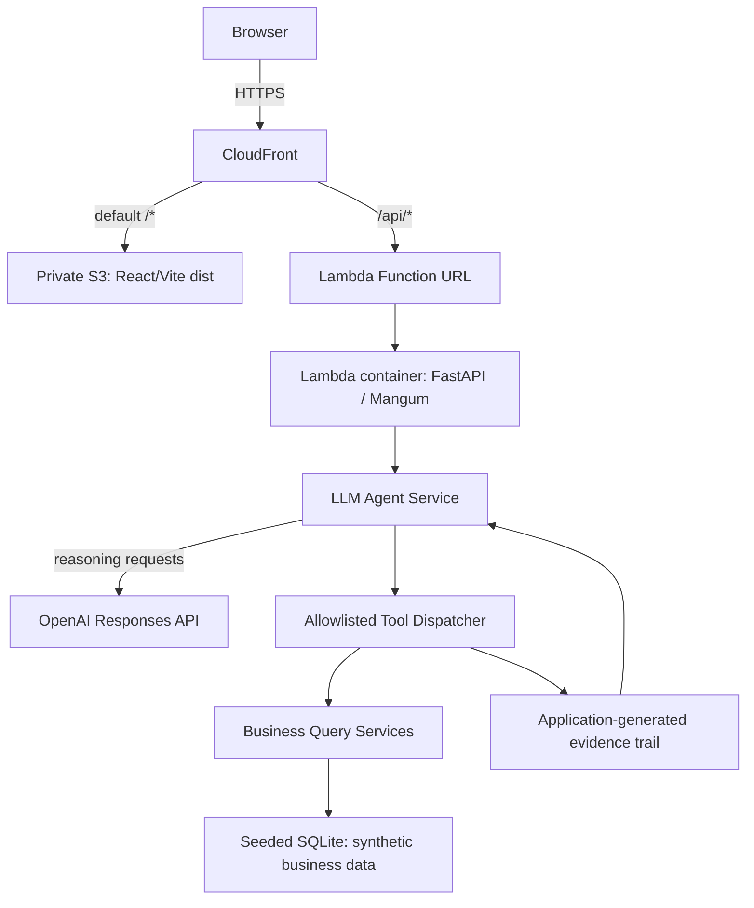

# OpsPilot

## Overview

OpsPilot is a portfolio-quality AI business-operations agent. It turns a business question into a traceable answer: an OpenAI Responses API agent selects structured business tools, the application queries synthetic operational data, and the frontend presents an evidence-backed recommendation. The project deliberately demonstrates practical agent/tool orchestration and business workflows without hiding the control flow behind a framework.

## Architecture



CloudFront is the intended public application entry point: private S3 serves the React/Vite assets by default and `/api/*` is forwarded over HTTPS to a Lambda Function URL, preserving same-origin requests. Task 008 prepares CloudFront-only Lambda access: the Function URL will use `AWS_IAM`, CloudFront will sign Lambda-origin requests through Origin Access Control, and the Function URL policy will allow only the intended distribution. This change has not been deployed, so the current Task 007 deployment remains directly accessible until the Task 008 Terraform is applied. OpenAI chooses which allowlisted tool to request; the application validates and executes that request. The LLM never accesses the database directly. Evidence is constructed by the application from actual tool results, and a recommendation is returned only when supporting evidence exists.

## Key engineering safeguards

- Strict tool schemas and an explicit allowlisted dispatcher; no dynamic dispatch or `eval`.
- Sequential tool execution, a four-call cap, and duplicate-call detection.
- Structured final model output and a recommendation-evidence guardrail.
- Synthetic, deterministic business data separated from agent orchestration.
- Controlled configuration and provider errors, plus frontend validation of successful response shapes.

## Example questions

1. Compare FW-100 sales and inventory. Is there a replenishment risk and what should we do?
2. Which product appears overstocked relative to demand, and what action would you recommend?
3. How is the Turbo Video Launch campaign performing, and should we continue spending on it?
4. How much inventory is available for FW-100?

## Screenshot

The initial workspace lets an operator enter a business question or start from a representative prompt.


## Local development

### Backend

From `backend/`, create and activate a virtual environment, then install development dependencies:

```powershell
python -m venv .venv
.\.venv\Scripts\Activate.ps1
python -m pip install -e ".[dev]"
```

Copy `.env.example` to `.env` only when overriding local defaults. `OPENAI_API_KEY` is supplied through the environment and is required for live agent questions; never commit it. The health endpoint and automated tests do not require an OpenAI key or PostgreSQL because tests use SQLite and mocks.

Run the API at <http://localhost:8000>:

```powershell
uvicorn app.main:app --reload
```

The health endpoint is `GET /api/health`. To seed the synthetic demo data, configure a database and run:

```powershell
python -m app.db.seed
```

For a disposable SQLite database:

```powershell
$env:DATABASE_URL = "sqlite:///./opspilot-demo.db"
python -m app.db.seed
```

### Frontend

From `frontend/`:

```powershell
npm install
npm run dev
```

Vite serves the UI at <http://localhost:5173> and proxies `/api` to the local FastAPI server.

## Quality checks

Backend, from `backend/`:

```powershell
python -m pytest
python -m ruff check app tests
python -m mypy app
python -m compileall -q app tests
```

Frontend, from `frontend/`:

```powershell
npm test -- --run
npm run lint
npm run typecheck
npm run build
```

GitHub Actions runs these independent backend and frontend quality jobs for pull requests and pushes to `main`. It uses no secrets, live OpenAI calls, or PostgreSQL service.

## AWS deployment (deployed and production-smoke-tested)

Task 007 deployed a small, cost-conscious AWS environment in [`infra/terraform/`](infra/terraform/). The public application is available at <https://d10nfs9ms4ms1h.cloudfront.net>.

The architecture is intentionally limited to a private S3 frontend bucket behind CloudFront, with `/api/*` routed by the same distribution to a Lambda Function URL backed by a Lambda-compatible FastAPI/Mangum container. This preserves the frontend's relative `/api/agent/query` request path and avoids a production CORS configuration. App Runner was removed because it is unavailable while this AWS account remains on its Free plan; Lambda provides request-driven execution without API Gateway.

The backend image runs the AWS Lambda Python 3.12 runtime. On Lambda cold start it loads the OpenAI key from the external SSM SecureString only if no process key is already set, seeds deterministic synthetic SQLite data at `sqlite:////tmp/opspilot.db`, then adapts the FastAPI application with Mangum. The deployed database is deliberately ephemeral and read-only to the application. PostgreSQL support remains available for normal local configuration.

Terraform uses normal local state only. It created an immutable, scan-on-push ECR repository (retaining five images), a 512 MB, 110-second, x86_64 Lambda image function, a public Function URL, a private S3 bucket with Origin Access Control, and one CloudFront distribution. No per-function reserved concurrency is configured: Lambda uses the account's available unreserved concurrency because the account quota is 10 and AWS must retain unreserved capacity. No VPC, RDS, load balancer, API Gateway, remote state, custom domain, or CI/CD deployment pipeline is provisioned.

The deployed backend artifact is image tag `992490a6220fe6b4ef3e27b4ebc68b9e8914bc93` (digest `sha256:b9fb97ec1431b31242b8a452070285c127a57856c5d6e14e7d6c8a4b2c2f889e`). The private frontend bucket contains the built React/Vite deployment, and CloudFront routes `/*` to S3 and `/api/*` to the Lambda Function URL.

### Initial deployment

Prerequisites are Terraform, Docker, AWS CLI credentials for the target account, and an OpenAI key in a local environment variable. Never place the key in `terraform.tfvars`, source control, a Docker image, or a shell command literal.

Set the named AWS profile and region for both AWS CLI and Terraform:

```powershell
$env:AWS_PROFILE = "opspilot"
$env:AWS_REGION = "ap-southeast-2"
$region = $env:AWS_REGION
```

If the temporary login has expired, authenticate the named profile first with `aws login --profile opspilot --region ap-southeast-2`. `AWS_PROFILE` directs both AWS CLI and Terraform to that profile; temporary credentials can expire and require that login again.

The first deployment deliberately has two phases because the private ECR repository must exist before a Lambda image can be pushed. From `infra/terraform/`, authenticate the intended AWS profile, initialize Terraform, verify identity, and run a normal plan before creating the external SecureString:

```powershell
$imageTag = git -C ../.. rev-parse HEAD
terraform init
aws sts get-caller-identity
terraform plan -var="backend_image_tag=$imageTag"
```

Create or update the SecureString outside Terraform. This command reads the value from the local environment rather than documenting it in command history:

```powershell
if (-not $env:OPENAI_API_KEY) { throw "Set OPENAI_API_KEY in your environment first." }
aws ssm put-parameter --name /opspilot/prod/openai-api-key --type SecureString --value $env:OPENAI_API_KEY --overwrite
```

Then bootstrap only ECR and its Lambda image-retrieval policy (the target is limited to this one-time bootstrap):

```powershell
terraform apply -target=aws_ecr_repository.backend -target=aws_ecr_lifecycle_policy.backend -target=aws_ecr_repository_policy.lambda_pull -var="backend_image_tag=$imageTag"
```

Then authenticate to ECR, build and push the immutable Git-SHA-tagged Lambda image, run a normal full plan, and perform the normal full apply:

```powershell
$repository = terraform output -raw ecr_repository_url
$registry = $repository.Split('/')[0]
aws ecr get-login-password | docker login --username AWS --password-stdin $registry
docker buildx build `
  --platform linux/amd64 `
  --provenance=false `
  --sbom=false `
  --load `
  --tag "opspilot-backend:$imageTag" `
  ../../backend
docker tag "opspilot-backend:$imageTag" "${repository}:$imageTag"
docker push "${repository}:$imageTag"
terraform plan -var="backend_image_tag=$imageTag"
terraform apply -var="backend_image_tag=$imageTag"
```

After Terraform creates the bucket and distribution, build and upload the frontend outside Terraform. Terraform manages infrastructure, not each compiled Vite file:

```powershell
Push-Location ../../frontend
npm ci
npm run build
Pop-Location
$bucket = terraform output -raw frontend_bucket_name
$distributionId = terraform output -raw cloudfront_distribution_id
aws s3 sync ../../frontend/dist "s3://$bucket" --delete
aws cloudfront create-invalidation --distribution-id $distributionId --paths "/*"
```

The public application URL is `terraform output -raw application_url`. CloudFront is the intended public application entry point and preserves the frontend's same-origin `/api/*` path. The Function URL is directly internet-accessible by design with `NONE` authorization; private ingress is intentionally not used because it would require additional VPC/PrivateLink infrastructure and cost.

### Verified deployment

Terraform infrastructure was applied successfully and its final infrastructure plan was clean before frontend deployment. The frontend was built and synced to the private S3 bucket (3 files, 234,991 bytes), and CloudFront invalidation `I2B19UQY6PHETREMQSMKLBL79R` completed.

Production smoke checks passed: direct Lambda Function URL `GET /api/health`, CloudFront `GET /api/health`, and CloudFront `GET /` all returned HTTP 200; the OpsPilot page and its JS/CSS assets were verified. One controlled live request through `/api/agent/query` also completed successfully in about 21.3 seconds. It used `query_sales` and `query_inventory` and correctly identified FW-100 as below its reorder point, with evidence-backed advice to verify or expedite inbound stock and continue replenishment.

To tear down a deployment, remove frontend objects if necessary and then destroy with the same immutable image tag:

```powershell
aws s3 rm "s3://$bucket" --recursive
terraform destroy -var="backend_image_tag=$imageTag"
```

Lambda provides request-driven execution instead of an always-running backend. This deployment does not configure per-function reserved concurrency, so Lambda uses the account's available unreserved concurrency; this avoids an unsupported reservation on the current low-quota AWS account. It does not create a cumulative OpenAI spending cap. ECR storage, S3 storage/requests, CloudFront delivery, Lambda usage, and OpenAI usage can still incur charges. This design is intended to stay within available Free-plan services/allowances for small demo usage, not as a guarantee of zero cost; configure provider billing and usage controls and destroy resources promptly when the demo is not needed.

The S3 bucket intentionally uses `force_destroy = false`, so frontend objects are removed manually before destroy. The Terraform-managed ECR repository uses `force_delete = true`, so its images are removed with the repository. The SSM SecureString is created outside Terraform and remains unless it is manually deleted.

## Limitations

- All business data is synthetic demo data.
- A local OpenAI API key is needed for live agent questions.
- There is no authentication, user account system, or persistent conversation history.
- Responses do not stream.
- The AWS deployment is a controlled demo environment, not a hardened production service: the Function URL/API is public and unauthenticated, and the Lambda `/tmp` SQLite database is ephemeral.
- This deployment has no authentication and its Lambda Function URL/API endpoint is public. Successful agent calls consume OpenAI API usage, so it is intended only as a controlled portfolio/demo deployment; configure provider billing and usage controls before public use, and destroy it when not needed.

See [ROADMAP.md](ROADMAP.md) for the planned delivery sequence.
