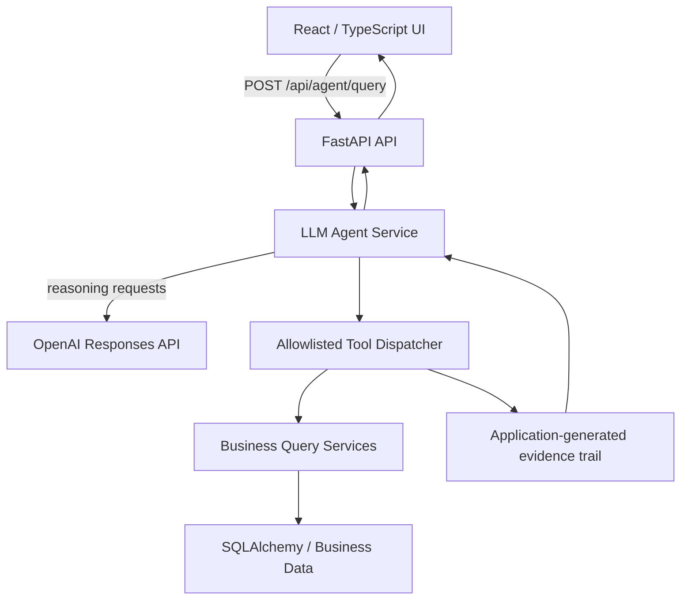
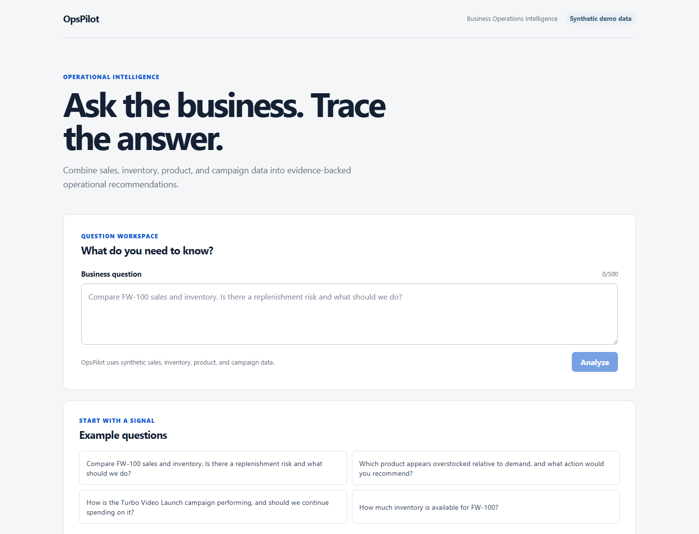

# OpsPilot

## Overview

OpsPilot is a portfolio-quality AI business-operations agent. It turns a business question into a traceable answer: an OpenAI Responses API agent selects structured business tools, the application queries synthetic operational data, and the frontend presents an evidence-backed recommendation. The project deliberately demonstrates practical agent/tool orchestration and business workflows without hiding the control flow behind a framework.

## Architecture



OpenAI chooses which allowlisted tool to request; the application validates and executes that request. The LLM never accesses the database directly. Evidence is constructed by the application from actual tool results, and a recommendation is returned only when supporting evidence exists.

## Key engineering safeguards

- Strict tool schemas and an explicit allowlisted dispatcher; no dynamic dispatch or `eval`.
- Sequential tool execution, a four-call cap, and duplicate-call detection.
- Structured final model output and a recommendation-evidence guardrail.
- Synthetic, deterministic business data separated from agent orchestration.
- Controlled configuration and provider errors, plus frontend validation of successful response shapes.

## Example questions

1. Compare FW-100 sales and inventory. Is there a replenishment risk and what should we do?
2. Which product appears overstocked relative to demand, and what action would you recommend?
3. How is the Turbo Video Launch campaign performing, and should we continue spending on it?
4. How much inventory is available for FW-100?

## Screenshot

The initial workspace lets an operator enter a business question or start from a representative prompt.



## Local development

### Backend

From `backend/`, create and activate a virtual environment, then install development dependencies:

```powershell
python -m venv .venv
.\.venv\Scripts\Activate.ps1
python -m pip install -e ".[dev]"
```

Copy `.env.example` to `.env` only when overriding local defaults. `OPENAI_API_KEY` is supplied through the environment and is required for live agent questions; never commit it. The health endpoint and automated tests do not require an OpenAI key or PostgreSQL because tests use SQLite and mocks.

Run the API at <http://localhost:8000>:

```powershell
uvicorn app.main:app --reload
```

The health endpoint is `GET /api/health`. To seed the synthetic demo data, configure a database and run:

```powershell
python -m app.db.seed
```

For a disposable SQLite database:

```powershell
$env:DATABASE_URL = "sqlite:///./opspilot-demo.db"
python -m app.db.seed
```

### Frontend

From `frontend/`:

```powershell
npm install
npm run dev
```

Vite serves the UI at <http://localhost:5173> and proxies `/api` to the local FastAPI server.

## Quality checks

Backend, from `backend/`:

```powershell
python -m pytest
python -m ruff check app tests
python -m mypy app
python -m compileall -q app tests
```

Frontend, from `frontend/`:

```powershell
npm test -- --run
npm run lint
npm run typecheck
npm run build
```

GitHub Actions runs these independent backend and frontend quality jobs for pull requests and pushes to `main`. It uses no secrets, live OpenAI calls, or PostgreSQL service.

## Limitations

- All business data is synthetic demo data.
- A local OpenAI API key is needed for live agent questions.
- There is no authentication, user account system, or persistent conversation history.
- Responses do not stream.
- The application is not deployed yet; deployment is planned for Task 007.

See [ROADMAP.md](ROADMAP.md) for the planned delivery sequence.
